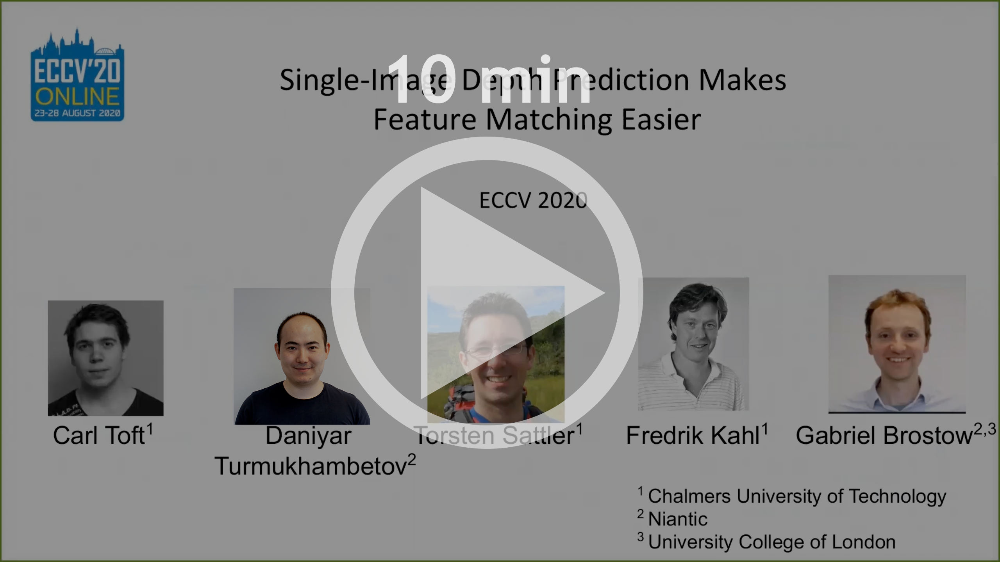
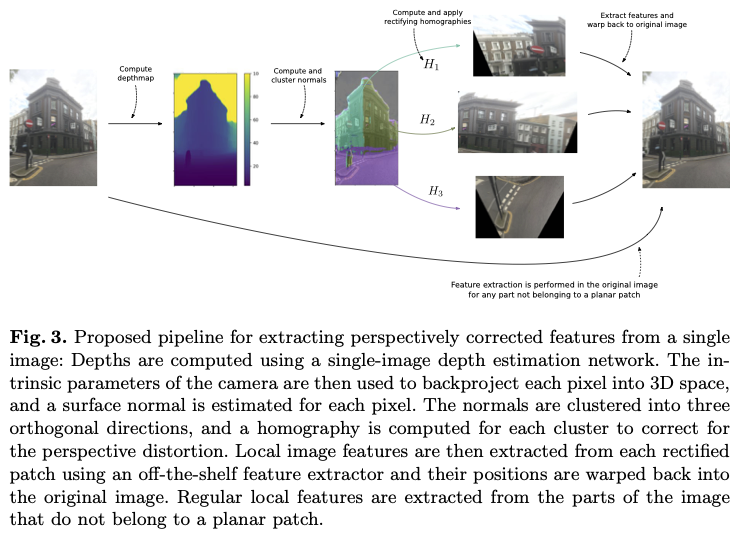

# [Single-Image Depth Prediction Makes Feature Matching Easier](https://arxiv.org/abs/2008.09497)

**[Carl Toft](https://scholar.google.com/citations?hl=en&user=vvgmWA0AAAAJ&view_op=list_works&sortby=pubdate), [Daniyar Turmukhambetov](http://dantkz.github.io/about), [Torsten Sattler](https://scholar.google.com/citations?user=jzx6_ZIAAAAJ&hl=en), [Fredrik Kahl](http://www.maths.lth.se/matematiklth/personal/fredrik/) and [Gabriel J. Brostow](http://www0.cs.ucl.ac.uk/staff/g.brostow/) – ECCV 2020**


[Link to paper](https://arxiv.org/abs/2008.09497)  
[Link to supplementary pdf](https://storage.googleapis.com/niantic-lon-static/research/rectified-features/rectified-features-supplementary.pdf)


<p align="center">
  <a href="https://storage.googleapis.com/niantic-lon-static/research/rectified-features/short-video.mp4">
  
  </a>
</p>


<p align="center">
  <a href="https://storage.googleapis.com/niantic-lon-static/research/rectified-features/long-video.mp4">
  
  </a>
</p>


**Code is coming soon...**  


Good local features improve the robustness of many 3D relocalization and multi-view reconstruction pipelines. The problem is that viewing angle and distance severely impact the recognizability of a local feature. Attempts to improve appearance invariance by choosing better local feature points or by leveraging outside information, have come with pre-requisites that made some of them impractical. In this paper, we propose a surprisingly effective enhancement to local feature extraction, which improves matching.

<p align="center">
  
</p>

We show that CNN-based depths inferred from single RGB images are quite helpful, despite their flaws. They allow us to pre-warp images and rectify perspective distortions, to significantly enhance SIFT and BRISK features, enabling more good matches, even when cameras are looking at the same scene but in opposite directions.

<p align="center">
  
</p>

Our pipeline finds planar patches according to estimated depth, and extracts features from rectified views of these patches. Non-rectified features are also extracted from regions that do not belong to planar patches.

## 💾 📸 Dataset

[Dataset README](https://storage.googleapis.com/niantic-lon-static/research/rectified-features/StrongViewpointChangesDataset/README.txt)

The "Strong Viewpoint Changes Dataset" is published as part of ECCV 2020 "Single-Image Depth Prediction Makes Feature Matching Easier" paper by 
Carl Toft, Daniyar Turmukhambetov, Torsten Sattler, Fredrik Kahl and Gabriel J. Brostow.

Please cite the paper if you are using this dataset.

The images, file pairs for evaluation and ground truth poses for the 8 scenes are
available at:
```
https://storage.googleapis.com/niantic-lon-static/research/rectified-features/StrongViewpointChangesDataset/scene1.zip

https://storage.googleapis.com/niantic-lon-static/research/rectified-features/StrongViewpointChangesDataset/scene2.zip

https://storage.googleapis.com/niantic-lon-static/research/rectified-features/StrongViewpointChangesDataset/scene3.zip

https://storage.googleapis.com/niantic-lon-static/research/rectified-features/StrongViewpointChangesDataset/scene4.zip

https://storage.googleapis.com/niantic-lon-static/research/rectified-features/StrongViewpointChangesDataset/scene5.zip

https://storage.googleapis.com/niantic-lon-static/research/rectified-features/StrongViewpointChangesDataset/scene6.zip

https://storage.googleapis.com/niantic-lon-static/research/rectified-features/StrongViewpointChangesDataset/scene7.zip

https://storage.googleapis.com/niantic-lon-static/research/rectified-features/StrongViewpointChangesDataset/scene8.zip
```

The dataset is published with Attribution 4.0 International (CC BY 4.0) License, see:
https://storage.googleapis.com/niantic-lon-static/research/rectified-features/StrongViewpointChangesDataset/LICENSE.txt


## ✏️ 📄 Citation

If you find our work useful or interesting, please consider citing [our paper](https://arxiv.org/abs/2008.09497):

```
@inproceedings{toft-2020-rectified-features,
 title   = {Single-Image Depth Prediction Makes Feature Matching Easier},
 author  = {Carl Toft and
            Daniyar Turmukhambetov and
            Torsten Sattler and
            Fredrik Kahl and
            Gabriel J. Brostow
           },
 booktitle = {European Conference on Computer Vision ({ECCV})},
 year = {2020}
}
```


# 👩‍⚖️ License
Copyright © Niantic, Inc. 2020. Patent Pending. All rights reserved. Please see the license file for terms.
